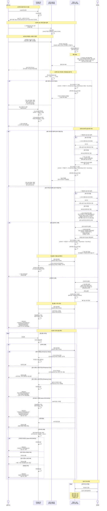

```mermaid
sequenceDiagram
    actor 설치기사
    participant 전자칠판앱 as 전자칠판 앱<br/>(오프라인)
    participant 설치웹 as 설치기사용 웹<br/>(모바일 최적화)
    participant 서버 as 백엔드 서버<br/>(관리자 웹 포함)
    actor 관리자

    Note over 설치기사,전자칠판앱: 1단계: 앱 설치 및 코드 생성
    설치기사->>전자칠판앱: USB로 앱 설치
    전자칠판앱->>전자칠판앱: SSAID 생성
    전자칠판앱-->>설치기사: QR 코드 + 8자리 코드 표시<br/>(QR 내용: https://install.plantynet.com?ssaid=AB12-CD34)

    Note over 설치기사,서버: 2단계: QR 스캔 및 정보 입력
    설치기사->>설치웹: 📱 스마트폰으로 QR 스캔<br/>(카메라 앱)
    설치웹->>설치웹: URL 파싱<br/>SSAID 추출 및 화면 표시 (AB12-CD34)

    Note over 설치기사,설치웹: 3단계: 전자칠판 시리얼 키 입력
    설치기사->>설치웹: 전자칠판 시리얼 키 입력<br/>(직접 입력 or 📷 사진 촬영)
    설치웹->>서버: 라이센스 발급 요청<br/>(SSAID: AB12-CD34, 전자칠판 시리얼 키)
    서버->>서버: 요청 대기열에 추가<br/>(상태: 승인 대기)
    
    Note over 서버: 메일 발송
    서버->>관리자: 📧 라이센스 요청 알림 메일<br/>제목: [긴급] 전자칠판 라이센스 승인 요청<br/>내용: SSAID, 시리얼 키, 요청 시간<br/>+ 승인 링크 (토큰 포함)
    
    서버-->>설치웹: 요청 접수 완료
    설치웹-->>설치기사: "승인 대기 중" 표시<br/>⏱️ 타이머 시작 (5분 카운트다운)

    Note over 설치웹,서버: 4단계: 임시 라이센스 자동 발급 (5분 후)
    설치웹->>설치웹: ⏱️ 타이머 카운트다운<br/>(5:00 → 4:59 → ... → 0:00)
    
    alt 5분 경과 & 관리자 미승인
        서버->>서버: 임시 라이센스 키 생성<br/>(SSAID + 시리얼 키 + isTemporary=true + ExpireDate(+14일) + SecretKey)
        서버->>서버: 상태 변경: 임시 승인 완료
        서버-->>설치웹: 🕐 임시 라이센스 키 발급<br/>(14일 만료 예정)
        설치웹-->>설치기사: "임시 승인 완료!" 알림<br/>+ 8자리 인증코드 표시<br/>(예: TMP5-6H78)<br/>⚠️ "2주 후 만료 예정"
        
        설치기사->>전자칠판앱: 임시 인증코드 입력<br/>"TMP5-6H78"
        전자칠판앱->>전자칠판앱: SecretKey로 복호화<br/>SSAID + 시리얼 키 검증
        전자칠판앱->>전자칠판앱: isTemporary=true 확인<br/>만료일 저장 (현재 + 14일)
        전자칠판앱-->>설치기사: ✅ 임시 인증 완료<br/>⚠️ "2주 후 정식 인증 필요"
    end

    Note over 서버,관리자: 5단계: 관리자 승인/거부 처리
    
    alt 5분 이내 링크 클릭 (임시키 발급 전)
        관리자->>서버: 📧 메일에서 승인 링크 클릭
        
        alt 로그인 안 됨
            서버-->>관리자: 🔐 로그인 페이지로 리다이렉트
            관리자->>서버: 로그인
            서버-->>관리자: 인증 성공 후 승인 페이지로 이동
        else 로그인 됨
            서버-->>관리자: 바로 승인 페이지로 이동
        end
        
        서버-->>관리자: ✅ 즉시 승인 화면<br/>(SSAID, 시리얼 키 자동 입력)<br/>현재 상태: 승인 대기 중
        관리자->>서버: 만료일 설정 후 [승인] 클릭<br/>(예: 1년 후)
        서버->>서버: 정식 라이센스 키 생성<br/>(SSAID + 시리얼 키 + isTemporary=false + ExpireDate(+1년) + SecretKey)
        서버->>서버: 상태 변경: 정식 승인 완료
        서버-->>설치웹: 실시간 알림<br/>(정식 라이센스 키 발급됨)
        설치웹-->>설치기사: "정식 승인 완료!" 알림<br/>+ 8자리 인증코드 표시<br/>(예: EF56-GH78)
        
    else 5분 이후 링크 클릭 (임시키 발급 후)
        관리자->>서버: 📧 메일에서 승인 링크 클릭
        
        alt 로그인 안 됨
            서버-->>관리자: 🔐 로그인 페이지로 리다이렉트
            관리자->>서버: 로그인
            서버-->>관리자: 인증 성공 후 승인 페이지로 이동
        else 로그인 됨
            서버-->>관리자: 바로 승인 페이지로 이동
        end
        
        서버-->>관리자: ⚠️ 임시키 발급 확인 화면<br/>"임시 라이센스가 이미 발급되었습니다"<br/>(SSAID: AB12-CD34, 시리얼 키)<br/>발급일: 2024-XX-XX XX:XX<br/>만료 예정: 2024-XX-XX (X일 남음)<br/><br/>[정식 승인하기] [거부하기] 버튼
        
        alt 정식 승인하기 선택
            관리자->>서버: [정식 승인하기] 클릭
            서버-->>관리자: 📝 만료일 설정 화면<br/>"정식 라이센스 만료일을 설정하세요"<br/>(SSAID, 시리얼 키 표시)<br/>만료일 입력 필드<br/>(기본값: 1년 후)
            관리자->>서버: 만료일 입력 후 [승인 확정] 클릭
            서버->>서버: 정식 라이센스 키 생성<br/>(SSAID + 시리얼 키 + isTemporary=false + ExpireDate + SecretKey)
            서버->>서버: 상태 변경: 정식 승인 완료
            서버-->>관리자: ✅ "정식 승인 완료"<br/>"앱 재실행 시 자동 업그레이드됩니다"
            
            Note over 전자칠판앱,서버: 앱 실행 시 자동 업그레이드
            전자칠판앱->>서버: 인증 상태 확인<br/>(SSAID: AB12-CD34)
            서버-->>전자칠판앱: ✅ 정식 라이센스로 업그레이드<br/>(isTemporary=false, 만료일: 1년 후)
            전자칠판앱->>전자칠판앱: 라이센스 정보 업데이트<br/>isTemporary=false로 변경
            전자칠판앱-->>설치기사: 🎉 "정식 인증 완료!"<br/>앱 정상 실행
            
        else 거부하기 선택
            관리자->>서버: [거부하기] 클릭
            서버-->>관리자: ⚠️ 거부 확인 화면<br/>"정말 거부하시겠습니까?"<br/>"즉시 앱 사용이 차단됩니다"<br/>[확인] [취소] 버튼
            관리자->>서버: [확인] 클릭
            서버->>서버: 라이센스 즉시 무효화<br/>상태 변경: 거부됨 (REVOKED)
            서버-->>관리자: ⛔ "승인 거부 완료"
            
            Note over 전자칠판앱,서버: 앱 실행 시 즉시 차단
            전자칠판앱->>서버: 인증 상태 확인<br/>(SSAID: AB12-CD34)
            서버-->>전자칠판앱: ⛔ 라이센스 거부됨<br/>(status=REVOKED)
            전자칠판앱->>전자칠판앱: 앱 실행 즉시 차단<br/>로컬 라이센스 삭제
            전자칠판앱-->>설치기사: 🚫 팝업 표시<br/>"라이센스가 거부되었습니다"<br/>"관리자에게 문의하거나"<br/>"재발급을 요청하세요"<br/>+ QR 코드 표시 (재인증용)
        end
    end

    Note over 전자칠판앱,서버: 6단계: 주기적 인증 확인
    loop 앱 실행 시마다
        설치기사->>전자칠판앱: 앱 실행
        전자칠판앱->>전자칠판앱: 인터넷 연결 확인
        
        alt 온라인 상태
            전자칠판앱->>서버: 인증 상태 확인<br/>(SSAID: AB12-CD34)
            
            alt 정식 인증됨 (isTemporary=false)
                서버-->>전자칠판앱: ✅ 정식 라이센스 확인<br/>(isTemporary=false, 만료일: 1년 후)
                전자칠판앱->>전자칠판앱: 라이센스 정보 업데이트
                전자칠판앱-->>설치기사: 앱 정상 실행
                
            else 임시 인증 & 14일 이내 (isTemporary=true)
                서버-->>전자칠판앱: ⏳ 임시 라이센스<br/>(isTemporary=true, 남은 기간: X일)
                전자칠판앱-->>설치기사: 앱 정상 실행<br/>+ 상단 배너: "정식 인증까지 X일 남음"
                
            else 임시 인증 & 14일 만료 (isTemporary=true)
                서버-->>전자칠판앱: ❌ 임시 라이센스 만료<br/>(isTemporary=true, 만료됨)
                전자칠판앱->>전자칠판앱: 앱 실행 차단
                전자칠판앱-->>설치기사: 🚫 팝업 표시<br/>"임시 인증이 만료되었습니다"<br/>"정식 인증을 요청하세요"<br/>+ QR 코드 표시 (재인증용)
                
            else 라이센스 거부됨 (status=REVOKED)
                서버-->>전자칠판앱: ⛔ 라이센스 거부됨
                전자칠판앱->>전자칠판앱: 앱 실행 즉시 차단<br/>로컬 라이센스 삭제
                전자칠판앱-->>설치기사: 🚫 팝업 표시<br/>"라이센스가 거부되었습니다"<br/>"관리자에게 문의하거나"<br/>"재발급을 요청하세요"<br/>+ QR 코드 표시
                
            else 인증 없음
                서버-->>전자칠판앱: ❌ 미인증 상태
                전자칠판앱-->>설치기사: 앱 정상 실행<br/>(로컬 저장된 만료일 확인)
            end
            
        else 오프라인 상태
            전자칠판앱->>전자칠판앱: 로컬 저장된 라이센스 확인<br/>(isTemporary + 만료일 + status)
            
            alt 거부된 라이센스 (status=REVOKED)
                전자칠판앱->>전자칠판앱: 앱 실행 차단
                전자칠판앱-->>설치기사: 🚫 팝업 표시<br/>"라이센스가 거부되었습니다"<br/>+ QR 코드 표시
                
            else 정식 인증 & 만료일 이내
                전자칠판앱-->>설치기사: 앱 정상 실행
                
            else 임시 인증 & 14일 이내
                전자칠판앱-->>설치기사: 앱 정상 실행<br/>+ 배너: "정식 인증 필요 (남은 X일)"
                
            else 만료일 초과
                전자칠판앱->>전자칠판앱: 앱 실행 차단
                전자칠판앱-->>설치기사: 🚫 팝업 표시<br/>"인증이 만료되었습니다"<br/>+ QR 코드 표시
            end
        end
    end

    Note over 서버,관리자: 실시간 모니터링
    loop 관리자 모니터링
        관리자->>서버: 대시보드 접속
        서버-->>관리자: 실시간 상태 업데이트
        Note over 서버: - 승인 대기: 2건<br/>- 임시 승인: 3건<br/>- 정식 승인: 5건<br/>- 거부됨: 1건
    end
```
